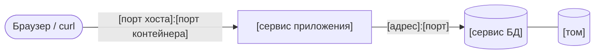

# Схема окружения проекта

> Бланк для воркшопа №3. Скопируйте файл в свой репозиторий как `docs/environment-schema.md`
> и заполните на занятии. Схема — техническое задание для практики №3: по ней вы напишете
> compose-файл. Раздел 4 заполняет **другая команда**, раздел 5 — снова вы. Что сделать после
> занятия — в разделе 6.
>
> Скопировать бланк из корня своего репозитория:
>
> ```bash
> # macOS / Linux / Git Bash
> curl -fsSL -o docs/environment-schema.md https://raw.githubusercontent.com/andrey-limasov/app-conf/main/workshops/workshop3/environment-schema-template.md
> # Windows PowerShell
> curl.exe -fsSL -o docs/environment-schema.md https://raw.githubusercontent.com/andrey-limasov/app-conf/main/workshops/workshop3/environment-schema-template.md
> ```
>
> Ключ `-f` нужен, чтобы при ошибке скачивания `curl` завершился с ошибкой, а не записал в файл текст `404: Not Found`.

**Команда:** [название]
**Проект:** [название, 1 предложение о том, что делает приложение]
**Дата:** 2026-XX-XX

## 0. Кто что делал

Заполняется для взаимооценки внутри команды. Роли можно совмещать, но у каждого участника должна быть хотя бы одна.

| Участник | Роль на воркшопе | Что конкретно сделал |
|---|---|---|
| [Имя] | Архитектор схемы | |
| [Имя] | Ведущий таблицы сервисов | |
| [Имя] | Автор ADR 002 | |
| [Имя] | Рецензент (проверяет схему другой команды) | |

## 1. Схема

Нарисуйте сервисы, связи между ними, опубликованные порты и тома. Подойдут Mermaid, фото рисунка на бумаге (файл положить в `docs/img/`) или ASCII-схема. В шаблоне Mermaid меняйте текст внутри кавычек, сами кавычки оставьте — без них квадратные скобки в подписях ломают схему.



## 2. Таблица сервисов

| Сервис | Образ или сборка | Порты `хост:контейнер` | Переменные окружения (только имена, без значений) | Тома | Зависит от (условие) | Healthcheck |
|---|---|---|---|---|---|---|
| | | | | | | |
| | | | | | | |

Если сервисов больше двух (например, Redis), для каждого дополнительного укажите одной фразой, зачем он нужен именно сейчас.

## 3. Ответы на контрольные вопросы

1. **Адрес базы.** По какому адресу приложение подключается к БД? Запишите шаблон строки подключения без пароля: `postgresql://[пользователь]@[хост]:[порт]/[база]`. Откуда приложение возьмёт пароль — назовите только имя переменной окружения
2. **Судьба данных.** Что будет с данными после `docker compose down`? А после `docker compose down -v`?
3. **Образ и запуск.** Что попадает внутрь образа приложения при сборке, а что передаётся только при запуске контейнера?
4. **Миграции.** Как схема базы будет создаваться при первом запуске? Гипотеза допустима, отметьте её словом «гипотеза» — её проверит практика №3 или модуль 3
5. **Запуск и проверка.** Одна команда, которая поднимает весь стек, и команда, которая доказывает, что стек поднялся (какой эндпоинт, какой ожидаемый ответ)

## 4. Проверка схемы другой командой

**Команда-рецензент:** [название]
**Рецензент:** [имя, логин GitHub]

Отметьте каждый пункт: ✅ выполнено, ❌ не выполнено, ⚠️ спорно. Для ❌ и ⚠️ комментарий обязателен.

| № | Критерий | Оценка | Комментарий |
|---|---|---|---|
| 1 | В стеке есть приложение и PostgreSQL; каждый дополнительный сервис обоснован | | |
| 2 | Версия образа БД зафиксирована (не `latest` и не без тега) | | |
| 3 | Приложение обращается к БД по адресу, который работает **внутри** сети Compose | | |
| 4 | Данные БД хранятся в именованном томе, путь монтирования соответствует версии PostgreSQL | | |
| 5 | Приложение стартует только после того, как БД готова (условие в зависимости + healthcheck у БД) | | |
| 6 | Наружу опубликованы только нужные порты; для каждого опубликованного порта понятно, зачем | | |
| 7 | Переменные окружения перечислены по именам, значений секретов в схеме нет | | |
| 8 | Есть ответ, как создаётся схема БД при первом запуске | | |
| 9 | Стек поднимается одной командой, есть проверяемый признак успешного запуска | | |

**Два самых важных замечания** (конкретно: что не так и что предлагаете):

1.
2.

**Вопрос к авторам, на который схема не отвечает:**

## 5. Что изменено по замечаниям

Заполняют авторы после проверки.

| Замечание | Что изменили или почему не согласны |
|---|---|
| | |

## 6. После воркшопа

Раздел не заполняется — это домашнее задание к практике №3. Схема и ADR 002 живут в **разных ветках**: у них разная судьба, и одна ветка на два PR не годится. Имена веток — по вашим правилам из `CONTRIBUTING.md`; команды на GitFlow создают обе ветки от `develop` и открывают PR в `develop`.

| № | Задание | Критерий готовности | Срок |
|---|---|---|---|
| 1 | Доработать схему по разделу 4, заполнить раздел 5 | `docs/environment-schema.md` смержен через PR с approval сокомандника в основную ветку разработки (`main` или `develop` по вашей стратегии) | 3 дня после воркшопа |
| 2 | Дописать ADR 002 | `docs/adr/002-dependency-manager.md`: все разделы шаблона заполнены, статус «Предложено», PR открыт, но **не смержен** — статус «Принято» ADR получит на практике №3 | К практике №3 |
| 3 | Подготовить инструмент | Каждый участник установил выбранный в ADR инструмент (`uv --version` или `poetry --version` отвечает). В `.gitignore` добавлена строка `.venv/` отдельным PR с сообщением `chore: ignore .venv` — uv по умолчанию создаёт окружение в `.venv`. Выполнен `docker pull` образа `python` с версией вашего проекта, например `python:3.12-slim` | К практике №3 |

### Как писать ADR 002 по шаблону ADR 001

Скопировать шаблон в ветку ADR:

```bash
# macOS / Linux / Git Bash
curl -fsSL -o docs/adr/002-dependency-manager.md https://raw.githubusercontent.com/andrey-limasov/app-conf/main/workshops/workshop2/adr-template.md
# Windows PowerShell
curl.exe -fsSL -o docs/adr/002-dependency-manager.md https://raw.githubusercontent.com/andrey-limasov/app-conf/main/workshops/workshop2/adr-template.md
```

Шаблон написан под стратегии ветвления. Что заменить:

| Раздел шаблона | Что писать в ADR 002 |
|---|---|
| Заголовок | `# ADR 002: Выбор менеджера зависимостей` |
| Контекст → «Уровень опыта команды с Git» | Опыт команды с pip, Poetry, uv; чем проект управляет зависимостями сейчас |
| Контекст → «Проблема» | Ваш список проблем с воркшопа из колонки «Менеджер зависимостей» |
| Рассмотренные варианты A/B/C | A — pip + `requirements.txt`, B — Poetry, C — uv. В начало раздела — таблица сравнения по критериям ниже |
| Решение → «Схема ветвления» | «Как ставятся зависимости»: команда для разработчика и команда для Dockerfile (гипотеза до практики №3) |
| Решение → «Правила работы с ветками» | Какие файлы коммитятся (`pyproject.toml`, lock-файл), как добавляется зависимость, как ставятся dev-зависимости |
| Обоснование → размер команды, частота релизов | Критерии, по которым выбранный вариант выигрывает |
| Связь с другими ADR → «Этот ADR является первым» | Ссылка на ADR 001 |

Критерии сравнения (минимум пять) и где искать ответ:

| Критерий | Где искать |
|---|---|
| Lock-файл: разделены ли прямые и транзитивные зависимости, есть ли хеши | Откройте lock-файл после пробной установки; для pip — `requirements.txt` после `pip freeze` |
| Фиксация версии Python | [uv: Working on projects](https://docs.astral.sh/uv/guides/projects/), [Poetry: Basic usage](https://python-poetry.org/docs/basic-usage/) |
| Разделение основных и dev-зависимостей | [uv: Managing dependencies](https://docs.astral.sh/uv/concepts/projects/dependencies/), [Poetry: Managing dependencies](https://python-poetry.org/docs/managing-dependencies/) |
| Установка строго по lock-файлу | [uv: Locking and syncing](https://docs.astral.sh/uv/concepts/projects/sync/), [Poetry: CLI](https://python-poetry.org/docs/cli/) — команды `install`, `sync`, `check --lock` |
| Скорость установки | Документация инструмента, пробная установка |
| Как инструмент ставится в Docker-образ | Гипотеза, проверяется на практике №3 |
| Стоимость перехода с текущего состояния проекта | Ваш репозиторий |
| Зрелость, документация, распространённость | Документация инструмента |
| Опыт команды | Команда |
